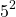
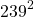

# pi-by-hand

Compute digits of PI in a way simulating calculations done by-hand
by a group of people. The algorithm was inspired by
[100 Digits of PI by Hand](https://www.youtube.com/watch?v=dtiLxLrzjOQ),
which describes the William Shanks method.

For this the following formula is used:

Multiplying both sides by 4 yields:

To compute arctan the following infinite series is used:

Plugging that into our formula for pi and splitting the faction gives us:

Notice how the second part of each term in the two infinite series differ by a factor of  for the first and  for the second. This allows each term to be calculated by a simple long division by a small integer using the value of the fraction in the previous term.

Even more beneficial is that the long division works digit by digit allowing all terms to be worked on in parallel. As soon as a digit has been calculated for the first fraction it can be passed to the calculation of the second fraction. Once that yields a digit it can be passed to the calculation of the third fraction and so on. The digits can also be passed to a second group of calculation adding the first part of each term, another long division by a small integer. Here is the workflow for the first series:

![\begin{array}{r O c O c O c O c O c}
16.00000... &\rightarrow& \boxed{Div 5 \Rightarrow \frac{16}{5}} &\rightarrow& \boxed{Div 25 \Rightarrow \frac{16}{5^3}}      &\rightarrow& \boxed{Div 25 \Rightarrow\frac{16}{5^5}}     &\rightarrow& \boxed{Div 25 \Rightarrow\frac{16}{5^7}}       &\rightarrow& ... \\
            &           & \downarrow                             &           & \downarrow                                     &           & \downarrow                                   &           & \downarrow                                     &           &     \\
            &           & \boxed{NOP \Rightarrow \frac{16}{5}}   &           & \boxed{-Div 3 \Rightarrow -\frac{16}{3 * 5^3}} &           & \boxed{Div 5 \Rightarrow \frac{16}{5 * 5^5}} &           & \boxed{-Div 7 \Rightarrow -\frac{16}{7 * 5^7}} &           & ... \\
            &           & \downarrow                             &           & \downarrow                                     &           & \downarrow                                   &           & \downarrow                                     &           &     \\
\end{array}](images/pipeline-5.png)

All this involves no number larger than 250 for the first series and 571210 for the second series. In the above youtube video it was suggested that a long division by  == 57121 would be faster when done as 2 long divisions by 239. The idea of passing calculated digits from one calculation to the next remains the same.

> Note 1: My suggestion would be to do both a long division by 57121 as well as 2 long divisions by 239 and compare the calculated digits as a verification method. For the first series a division by 25 is already easy. So instead of verifying this by 2 long divisions by 5 I would go the other way and do a long division by 625, skipping a term and comparing it to the one after that. This can be used to verify every second term or 2 chains of dividing by 625 can be calculated starting at the first and second term each so every term is calculated in 2 seperate ways.

> Note 2: As 5 is a factor of 10 the Div5 and Div25 calculations only produce a limited number of digits before the long divions has a remainder of 0 and the calculation is finished. Passing on an infinite series of 0 digits is then implied. This then causes the Div\<n\> calculations to enter a loop where the remainders always repeat. These loops can be detected easily and all further digits can be created by repeating the loop over and over without doing any more calculations. Unfortunately this only works for the first series and not the second.

--

Images for formulas thanks to [QuickLatex](https://quicklatex.com/)

